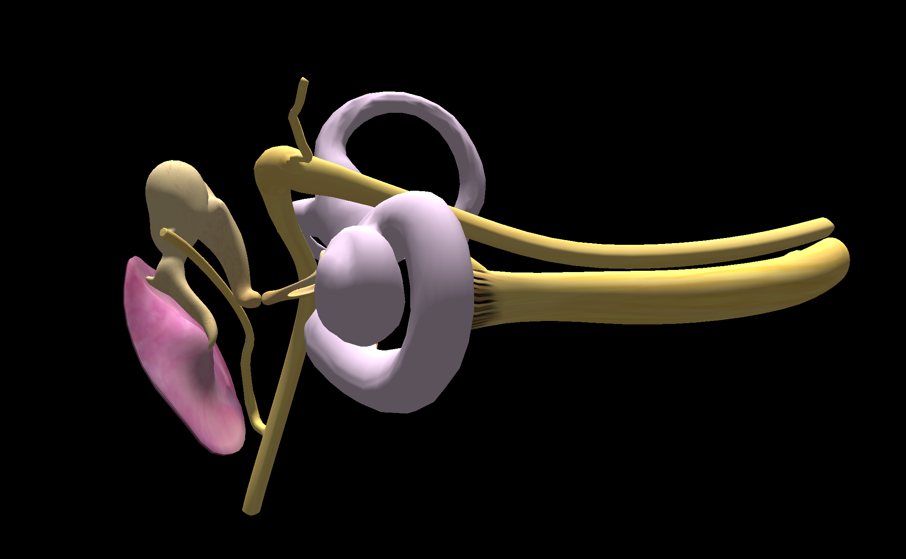
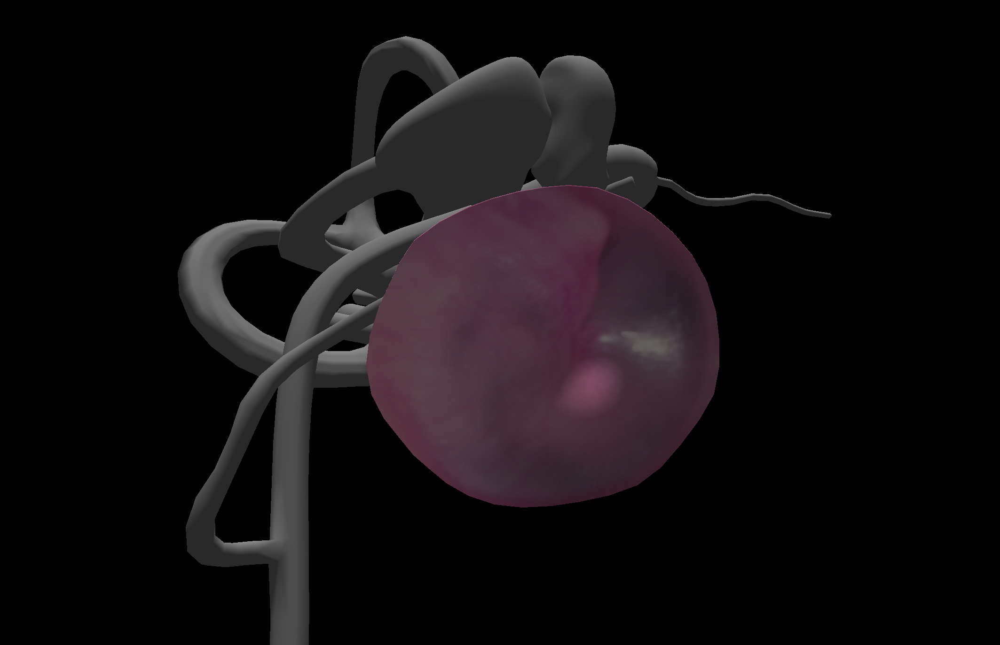

# Inner Ear visualisation

Qt Rendering Hardware Interface (RHI) desktop app visualising a 3d model of an inner ear.
Allows for basic 3d model manipulation such as rotation, zoom as well as selecting some parts for closer inspection.

## Usage

Build the project using CMake.

In the app use **left mouse button** to rotate the model and **mouse wheel** to zoom in and out.
Press **left mouse button** on a piece of the ear to select it (zooming in and greying out other parts).
Press **right mouse button** to deselect the piece and come back to standard view.

## Implementation Overview

1. Model of the inner ear is being loaded using [assimp](https://github.com/assimp/assimp) and textures are being read using [stb](https://github.com/nothings/stb).
Both libraries are added as source code to allow for quick code inspection and potential changes if needed.
2. Rendering follows standard model, view, projection transforms, with custom uncommon handling of rotations.
To make the code simpler the rotations even though technically, should be viewed as camera rotations, are kept separate
in `modelRotation` matrix. This allows me to distinguish between `lookAt` transform and `rotations` and simplify
code for zooming or 'selecting' a piece of inner ear (during which camera zooms towards the selected piece).
3. 'Selecting' a piece of inner ear, zooms camera over the short duration.
To make this process more appealing, tweening (easing) was used. 
For the implementation of easing functions [this code](https://github.com/nicolausYes/easing-functions) was added as 3rd party library.
4. I did not find a lot of situations in which modern C++ features would be useful.
The program does not have dynamic parts, in which objects would be created and then deleted.
Because of that for memory management I stuck to raw pointers instead of smart pointers, apart from a couple of examples.
5. The pipeline rendering the ear uses a simple light calculations in the spirit of Phong lighting model with
static ambient part and one light source coming directly from above. Specular highlights were omitted.
Materials (textures) and normals are being read from model and passed to shaders.
I updated the CMake handling of the shaders to compile them on change.
6. Apart from the pipeline used to render ear, there is a second one for debugging rays. 
It is turned off by default. It uses Line Strip as rendering primitive. 
Rays are being used in raycasting, when determining which of the parts was clicked.
7. The setup of Swap Chain and the resources needed for having basic rendering where adapted from
[Qt RHI example](https://doc.qt.io/qt-6/qtgui-rhiwindow-example.html).
The consequence of that is the split between `RhiWindow` and `AppWindow` classes.
What was most probably envisioned in the example as the split between low level window and chain setup and business 
logic setup in reality has quite blurry lines, requiring transformation matrices to exist in the RhiWindow class.
8. In order to hide some of the complexity regarding re-orienting camera, a `Camera` class was created that can be
used to both set the new rotation or read the current one.